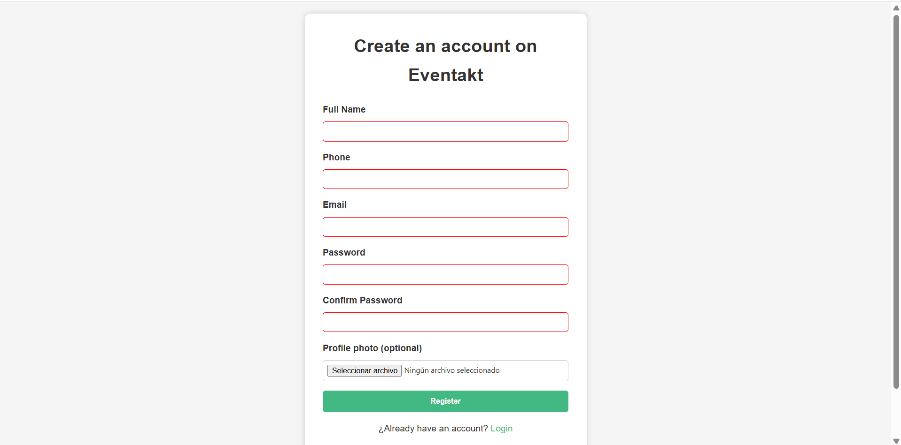

# Eventakt 📅🚀

## Description
This web application helps users organize their personal agenda by managing contacts and events in a calendar. Users can create an account to securely access their information, add or edit contacts with details and optional images, and schedule events with title, description, date, time, and category. Events can be linked to contacts and are displayed in an intuitive monthly calendar view for easy planning.

## Technologies
- **Frontend:** Vue 3 + Vite  
- **Backend:** Spring Boot  
- **Database:** PostgreSQL  
- **Others:** dayjs, vue-toastification

## Features
- User authentication and secure account management
- Create and manage contacts, including adding profile pictures and organizing them into groups
- Create and manage events with categories, dates, times, and associated contacts
- Monthly calendar view and daily agenda
- User interface optimized for desktop use
- Notifications and confirmations via pop-up messages

## Installation 
1. Clone the repository:
git clone https://github.com/RaulHoyoss/eventakt.git
cd eventakt

2. Backend:
Install Java 17 and Gradle
Install PostgreSQL or use Docker
Create the required database
cd backend
./gradlew build
./gradlew bootRun

3. Frontend
cd frontend
npm install
npm run dev

 ## Screenshots
 
 ### MAIN
 #### Login
 
 
 #### User Registration
 

 #### Calendar
 

 ### EVENTS
 #### day with events

#### create/edit Event

### CONTACTS
#### Contact list

#### Create/Edit Contact

## License
This project is licensed under the MIT License. [LICENSE](LICENSE) file for details.

## Contact
-Raúl Hoyos - raulhzmgl@gmail.com
- GitHub Repository: https://github.com/RaulHoyoss